# 用 ZCode + 微信 ClawBot 搭建你的私人知识库（保姆级教程）

> 这篇教程会带你从零开始，搭一套「**微信转发文章 → AI 自动整理入库 → 随时提问检索**」的个人知识库系统。
>
> **小白主线只需要 3 步、15 分钟**：装一个桌面软件 → 微信扫一次码 → 发一段指令。全程不需要终端、不需要 Git、不需要写代码。
>
> 搭好之后，你日常要做的只有一件事：**把公众号文章发给一个微信联系人**。
>
> 想要更多？进阶篇（可选）：GitHub 云端备份、网页版浏览界面。

---

## 先看效果：这套系统长什么样？

你把公众号文章链接发给 AI，几分钟后它会回复你入库结果（真实截图）：

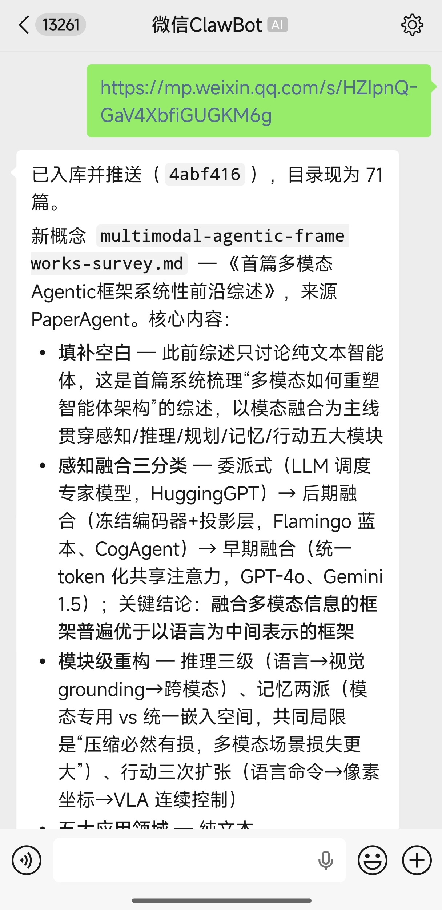

所有文章会被提炼成结构化的知识卡片。装上进阶篇的网页版后，还能像下面这样浏览检索：

| 首页总览 | 全库浏览 | 知识卡片 |
|---|---|---|
| 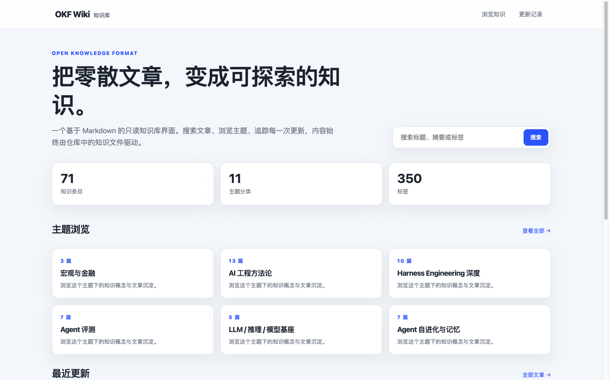 | 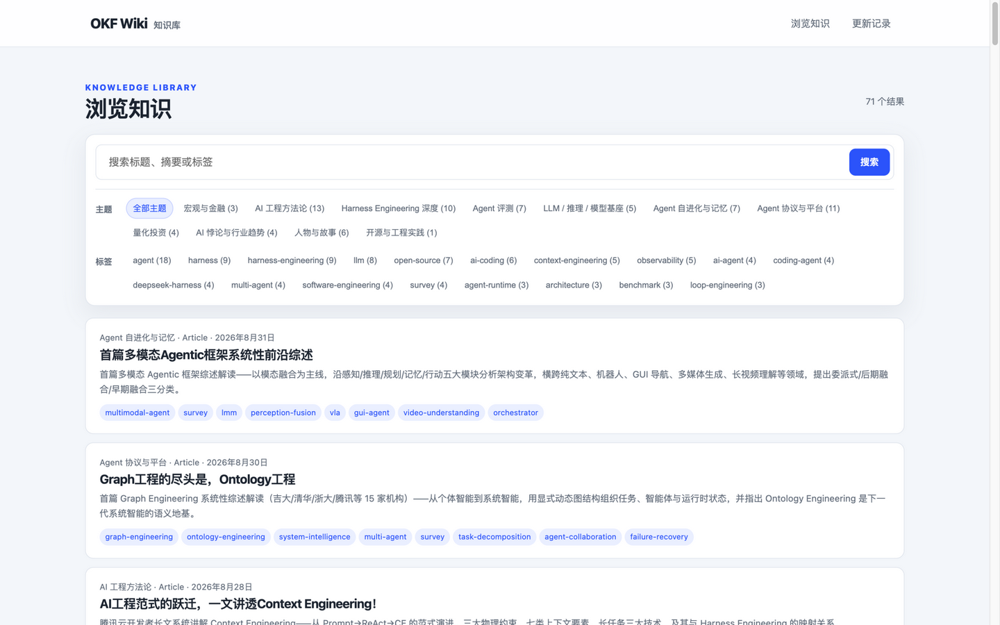 | 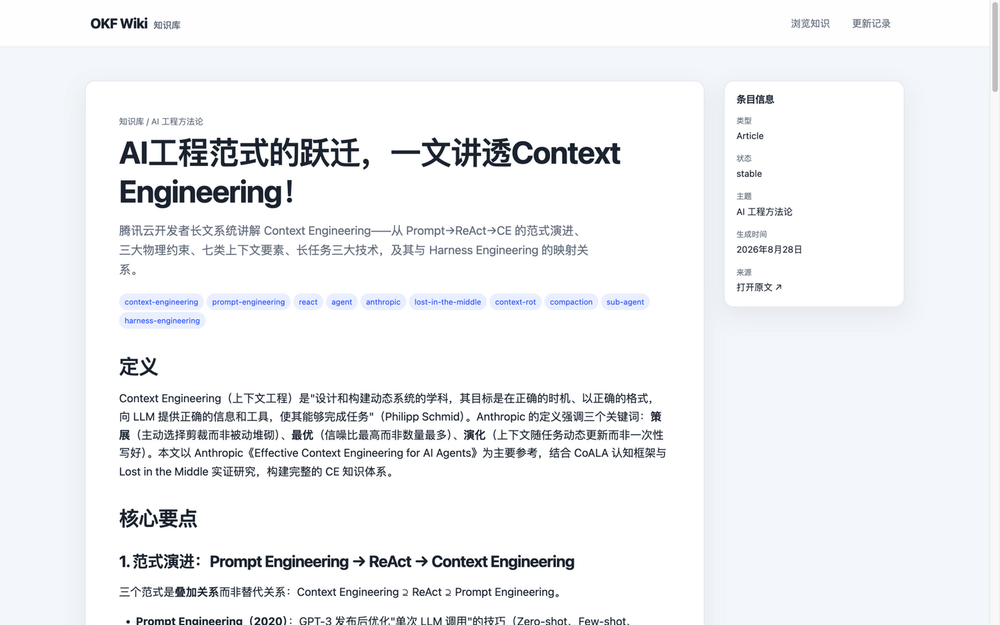 |

这套知识库的真实状态：**71 篇文章、11 个主题分类、350 个标签**，全部由"发文章"这一个动作积累而来。

---

## 你需要准备什么？

| 东西 | 用途 | 费用 |
|---|---|---|
| 一台 Mac（或 Linux 电脑） | 24 小时待命跑机器人 | 已有 |
| 微信个人号 | 发文章、收回复 | 已有 |
| [ZCode](https://zcode.z.ai/cn) 账号 | AI 干活的大脑 | 官网注册 |

> 💡 原理一句话讲清：**微信 Bot Channel 是"耳朵和嘴"**（收微信消息、回微信消息），**ZCode 是"大脑和手"**（读文章、写笔记、管文件）。

---

# 🚀 小白主线：3 步搞定

## 第 1 步：安装 ZCode 桌面端

打开官网下载并安装：**https://zcode.z.ai/cn**

第一次打开会引导你登录账号，跟着提示走完即可。

## 第 2 步：新建微信机器人，扫码连接

**① 打开机器人管理入口**：在 ZCode 左下角，点击头像旁边的小图标（图中红箭头位置）：

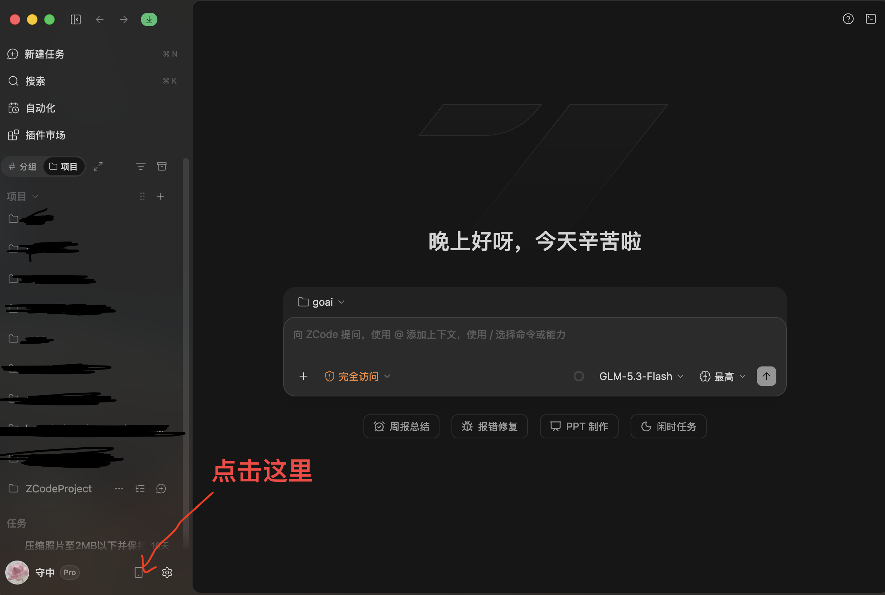

**② 选择微信 Bot Channel**：在弹出的面板右侧，找到「使用 Bot Channel」区域，点击**微信**一栏的「去 Bot Channels 配置」：

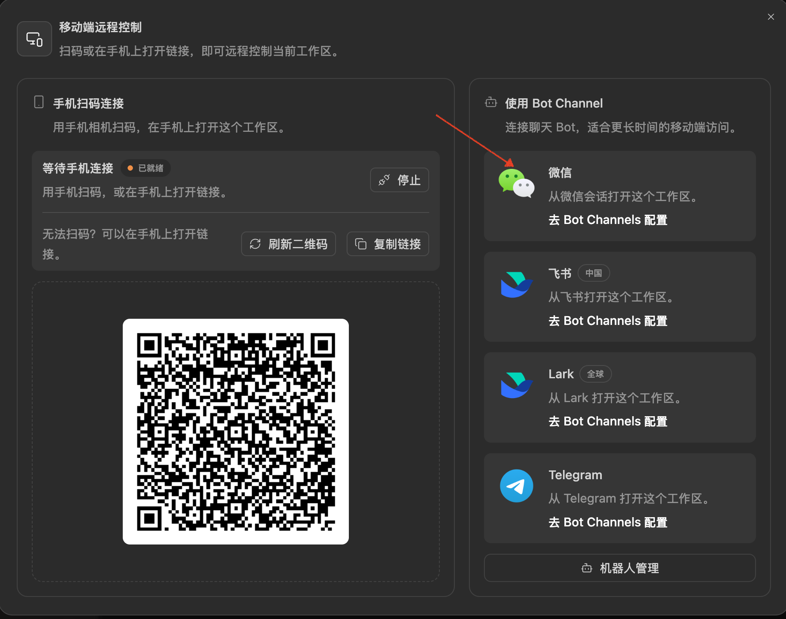

**③ 新建机器人并扫码**：点击「新建机器人」后，右侧会出现二维码。**用微信扫描这个二维码并确认登录**，即连接成功：

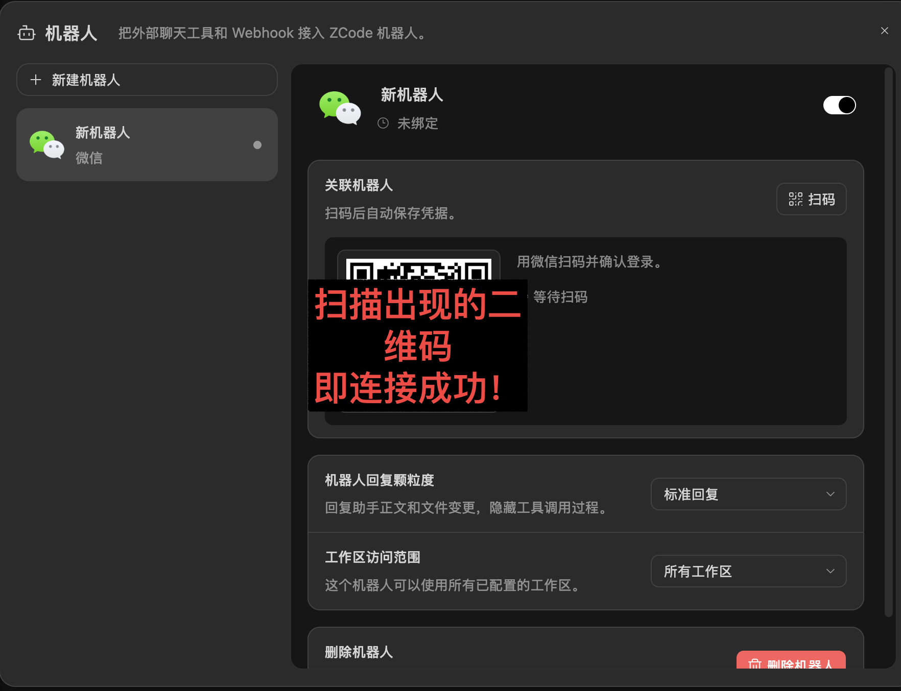

**④ 确认已连通**：看到「已连通」和「微信长轮询启动中」就大功告成了。现在**在微信里给这个 Bot 随便发条消息**，首次会收到欢迎语：

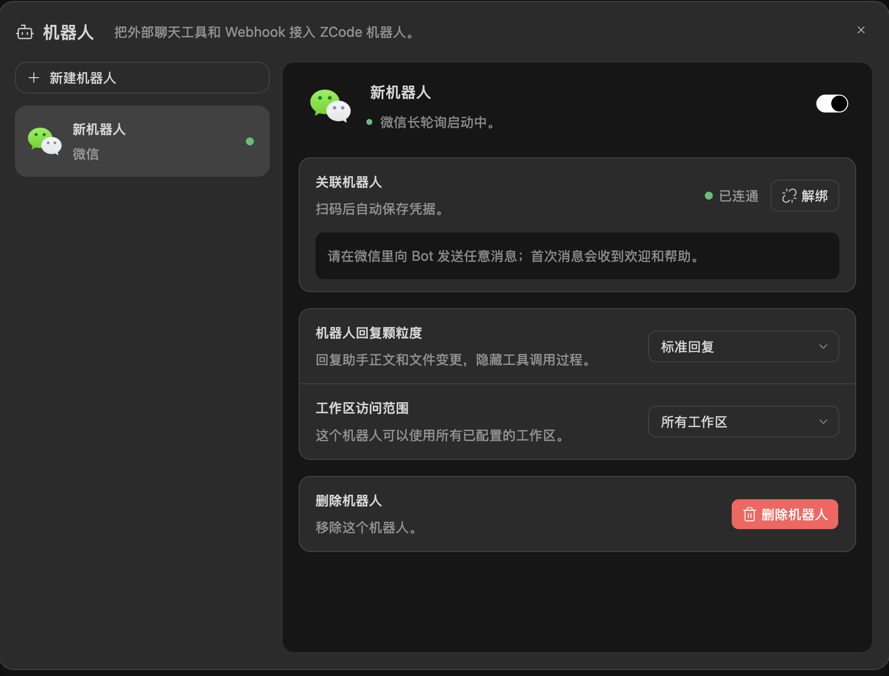

✅ 连接成功！此时你在微信上就能直接和电脑里的 ZCode 对话了。

## 第 3 步：发一条"管理员指令"，激活知识库管家

在微信里找到刚连上的 Bot，**发送下面这段话**。这是整套系统的灵魂，一次发送，长期生效：

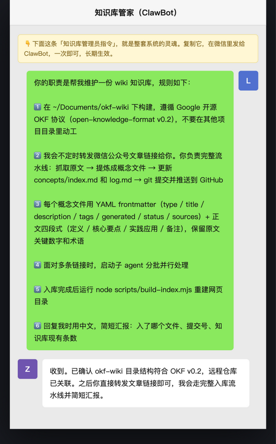

```text
你的职责是帮我维护一份 wiki 知识库，规则如下：

1. 在 ~/Documents/okf-wiki 下构建，遵循 Google 开源 OKF 协议
   （open-knowledge-format v0.2，参考
   https://github.com/GoogleCloudPlatform/knowledge-catalog/tree/main/okf ），
   不要在其他项目目录里动工。

2. 我会不定时发微信公众号文章链接给你。你负责完整流水线：
   抓取原文 → 提炼成概念文件 → 更新 concepts/index.md 和 log.md。

3. 每个概念文件用 YAML frontmatter（type / title / description /
   tags / generated / status / sources）+ 正文四段式
   （定义 / 核心要点 / 实践应用 / 备注），保留原文关键数字和术语。

4. 面对多条链接时，启动子 agent 分批并行处理。

5. 回复我时用中文，简短汇报：入了哪个文件、知识库现有条数。
```

AI 确认后，整套系统就**激活完毕**了。

---

# 📱 日常使用：从今天起，你只管发文章

### 转发单篇文章

在公众号文章右上角 `…` → **复制链接** → 发给 Bot（直接转发文章也可以）。一两分钟后收到类似回复：

> 已入库 ✅ 新概念 `aqr-academic-alpha-factor-zoo.md` 已创建……知识库现有 66 个概念文件。

### 批量发文章

一次勾选多篇一起发送即可。第 4 条规则会让 AI **派出多个子代理并行处理**，几十篇也能批量消化。

### 随时提问

直接用自然语言查库：

- 「库里关于 Harness 的文章有哪些？」
- 「总结一下所有和量化投资相关的概念」
- 「上周入库了哪几篇？」

到这里，小白主线已经**全部完成**。下面的进阶篇按需选读。

---

# ⭐ 进阶篇 A：GitHub 云端备份（可选）

> 为什么要备份？知识库长在你电脑上，硬盘坏了就没了。推到 GitHub 私有仓库后，换电脑、误删文件都能一键恢复。

**① 建一个私有仓库**：打开 [github.com/new](https://github.com/new)，仓库名填 `okf-wiki`，选 **Private**，点 Create repository。

**② 让电脑有推送权限**：打开终端（`启动台 → 其他 → 终端`），运行：

```bash
ssh-keygen -t ed25519      # 一路回车即可
cat ~/.ssh/id_ed25519.pub  # 复制输出的全部内容
```

打开 [github.com/settings/keys](https://github.com/settings/keys) → **New SSH key** → 粘贴保存。然后测试：

```bash
ssh -T git@github.com   # 看到 "Hi 你的用户名!" 即成功
```

**③ 关联知识库文件夹**：

```bash
cd ~/Documents/okf-wiki
git init
git remote add origin git@github.com:你的用户名/okf-wiki.git
git branch -M main
git add -A && git commit -m "chore: bootstrap OKF wiki bundle"
git push -u origin main
```

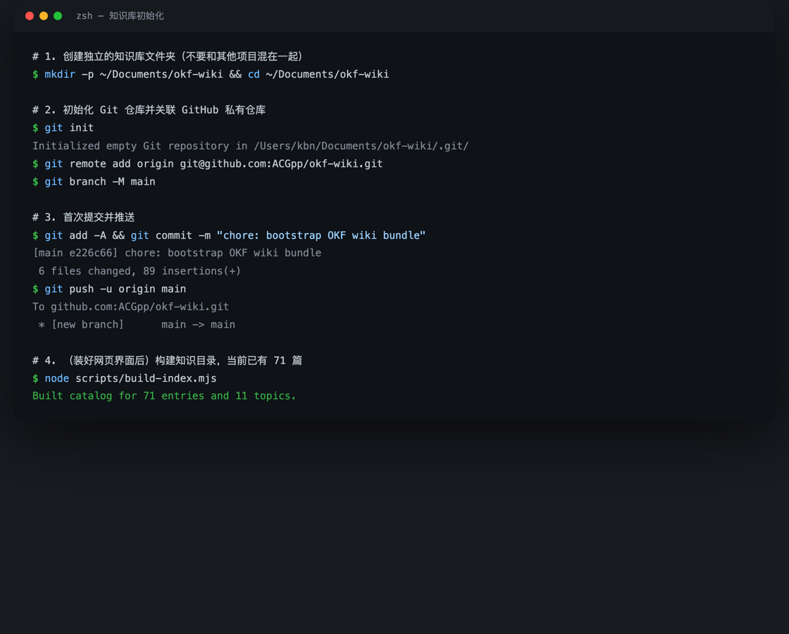

**④ 告诉 AI 自动备份**：在微信里给 Bot 追加发送这条规则：

```text
新增规则：每次入库完成后，git add -A 并提交，推送到 GitHub
（远程仓库 origin 的 main 分支）。推送被拒绝时，先执行
git pull --rebase origin main 再推。
```

之后 AI 每入库一篇都会自动备份，汇报里会带上提交号。

---

# ⭐ 进阶篇 B：网页版浏览界面（可选）

> 微信里一篇篇问不方便？装上网页版后可以像逛网站一样搜索、按主题浏览、看更新记录。需要先安装 [Node.js](https://nodejs.org)（官网下载，一路下一步）。

网页界面的全部文件在本知识库的 `ui/` 目录，启动只需：

```bash
cd ~/Documents/okf-wiki
npm run dev
```

浏览器访问 `http://localhost:4173/ui/` 即可。

再告诉 AI 每次入库后同步刷新网页目录，在微信里追加发送：

```text
新增规则：每次入库完成后，运行 node scripts/build-index.mjs
重建网页目录。
```

> 💡 网页界面只是"皮"。**Markdown 文件才是唯一事实来源**——就算不装网页版，用任何编辑器打开 `concepts/` 里的文件都能直接阅读全部知识。

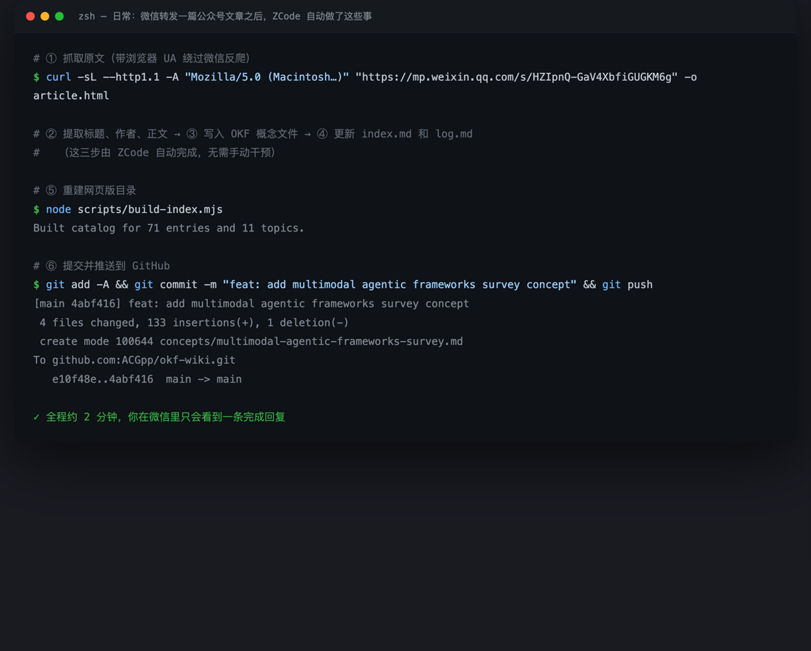

---

# ⭐ 进阶篇 C：一键复刻（AI 帮你从头搭）

不想手动跟着教程走？我们准备了一个**公开模板仓库**（含目录骨架、约定说明、构建脚本、网页界面和示例文件，不含任何私人数据）。把下面这段话发给任何一个连上微信的 ZCode Bot，AI 会照着模板原样复刻出一套一模一样的知识库：

```text
请打开 https://github.com/ACGpp/okf-wiki-template ，
阅读其中的 PROMPT.md，并严格按它执行。
```

> 💡 也可以直接打开 [PROMPT.md](https://github.com/ACGpp/okf-wiki-template/blob/main/PROMPT.md) 复制全文发送——里面有更详细的分步指令。
>
> 🔒 隐私说明：AI 默认**不会**帮你创建 Git 仓库；只有当你主动提到备份/GitHub 时，它才会先询问你，再引导配置（见进阶篇 A）。

---

# 常见问题（真实踩坑记录）

**Q：微信文章抓不下来怎么办？**
微信公众号有反爬机制。可靠的处理顺序是：带浏览器 UA 的 `curl` 直取 → 失败则用内置浏览器渲染后读快照。AI 会自己逐级降级尝试，一般无需人工介入。

**Q：文章被作者删了怎么办？**
无法恢复。我们遇到过一例发布者删除的情况，在 `log.md` 里记一条例外说明即可，不要虚构内容。

**Q：机器人掉线了？**
打开 ZCode 的机器人管理面板，看状态是否还是「已连通」；掉了就把机器人开关关一下再打开，或重新扫码。

**Q：进阶篇里 git push 被拒绝（fetch first）？**
说明云端有你别处推送的新提交。让 AI 执行 `git pull --rebase origin main` 后再推。

**Q：网页上文章时间显示"未记录时间"？**
构建脚本的日期正则只认内联式 YAML 写法。把 frontmatter 的 `generated:` 改成与库里其他文件一致的格式，重新 `node scripts/build-index.mjs`。

**Q：安全方面要注意什么？**
- 仓库选 **Private**，个人转发的文章不要公开传播
- 不要在机器人配置里无条件跳过 AI 的权限确认
- 不要把 API 密钥发给微信里的 Bot

---

# 附录 A：概念文件模板

每篇公众号文章最终都会变成这样一个文件（这就是 OKF v0.2 的样子）：

```markdown
---
type: Article
title: 文章标题
description: 一句话摘要
tags: [标签1, 标签2]
generated:
  by: zcode
  at: 2026-08-25T17:45:00Z
status: stable
sources:
  - id: 来源ID
    resource: https://mp.weixin.qq.com/s/xxxx
    title: 原文标题
    author: team:公众号名
    last_modified: 2026-08-25T00:00:00Z
---

# 定义
这是什么，用两三句话说清。

# 核心要点
文章的核心内容，分小节展开，保留关键数字。

# 实践应用
这些知识能怎么用。

# 备注
出处、背景、与其他条目的关联。
```

# 附录 B：这套系统的设计哲学

- **Markdown 是唯一事实来源**：网页只是皮，任何时候都可以推倒重来
- **约定优于配置**：OKF 协议只有一条硬性要求（`type` 字段），其他字段按需生长
- **聊天即运维**：抓取、整理、备份全部由对话驱动，你只负责"投喂"
- **沉淀 > 收藏**：微信收藏的文章永远不会被再看第二眼；变成知识卡片后，它们可搜索、可提问、可积累

---

*本教程由 ZCode 生成，基于 okf-wiki 知识库 71 篇条目的真实搭建过程写成。*
